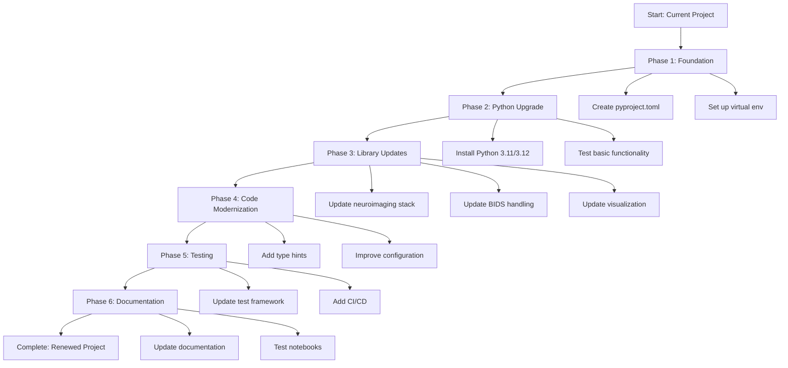

# Project Renewal Plan: OpenCloseProject

## Current State Analysis

### Python Version
- **Current**: Python 3.10.12
- **Target**: Python 3.11 or 3.12 (recommend 3.11 for better library compatibility)

### Key Dependencies Identified
1. **Core Scientific Stack**: numpy, pandas, scipy
2. **Neuroimaging**: nilearn, nibabel
3. **BIDS Handling**: pybids (bids library)
4. **Visualization**: matplotlib, seaborn
5. **Utilities**: tqdm, pathlib, requests
6. **Testing**: pytest

### Project Structure
- Main package: `denoising/` with modular architecture
- Atlas data in `atlas/` directory
- Example notebooks in `notebooks/`
- Tests in `denoising/test/` and `tests/`

## Upgrade Plan

### Phase 1: Foundation & Dependency Management

#### Step 1.1: Create Modern Dependency Management
- Create `pyproject.toml` with:
  - Project metadata and Python version constraint (>=3.11)
  - Build system configuration
  - Dependency specifications with version ranges
  - Optional development dependencies

#### Step 1.2: Set Up Virtual Environment
- Create `.python-version` file for pyenv/conda
- Update documentation for environment setup
- Create environment.yml for conda users (optional)

#### Step 1.3: Initial Dependency Audit
- Document current implicit dependencies
- Check for deprecated imports or APIs
- Identify minimum compatible versions

### Phase 2: Python Version Upgrade

#### Step 2.1: Update Python Interpreter
- Install Python 3.11 or 3.12
- Update CI/CD configuration (if any)
- Test basic functionality with new Python version

#### Step 2.2: Update Core Dependencies
- Update numpy, pandas, scipy to latest compatible versions
- Test numerical computations remain consistent
- Address any deprecation warnings

### Phase 3: Library-Specific Updates

#### Step 3.1: Neuroimaging Stack Update
- Update nilearn to latest version (check API changes)
- Update nibabel for NIFTI handling
- Test atlas loading and masker functionality

#### Step 3.2: BIDS Handling Update
- Update pybids to latest version (significant API changes possible)
- Review `denoising/dataset.py` for compatibility
- Test BIDSLayout initialization and queries

#### Step 3.3: Visualization & Utilities
- Update matplotlib, seaborn for plotting
- Update tqdm for progress bars
- Ensure pathlib usage is compatible

### Phase 4: Code Modernization

#### Step 4.1: Add Type Hints
- Add Python type hints to all function signatures
- Use `typing` module for complex types
- Consider using `mypy` for type checking

#### Step 4.2: Improve Configuration
- Remove hardcoded paths from `run_denoise.py` and other files
- Create configuration system (config file or environment variables)
- Update notebook examples to use new configuration

#### Step 4.3: Enhance Error Handling
- Add more specific exception handling
- Improve error messages for user clarity
- Add input validation where missing

### Phase 5: Testing & Quality Assurance

#### Step 5.1: Update Test Framework
- Ensure pytest works with updated dependencies
- Add missing test cases for core functionality
- Create integration tests for full pipeline

#### Step 5.2: Add CI/CD Pipeline
- Create GitHub Actions workflow (if using GitHub)
- Add automated testing on Python 3.11/3.12
- Add dependency update checks

#### Step 5.3: Performance Testing
- Benchmark critical operations (atlas loading, denoising)
- Identify potential performance improvements
- Consider async/parallel processing where applicable

### Phase 6: Documentation & Examples

#### Step 6.1: Update Documentation
- Refresh README with new setup instructions
- Update docstrings to match updated APIs
- Add migration guide for users

#### Step 6.2: Update Notebooks
- Test all Jupyter notebooks with updated dependencies
- Update notebook examples to use new APIs
- Add comments explaining changes

#### Step 6.3: Create Examples
- Add minimal working examples
- Create tutorial for new users
- Document common use cases

## Risk Assessment & Mitigation

### High Risk Areas
1. **pybids API Changes**: BIDS library has undergone significant changes. Need thorough testing of `denoising/dataset.py`.
2. **nilearn API Changes**: Check `load_confounds` and `NiftiLabelsMasker` usage.
3. **Hardcoded Paths**: Scripts like `run_denoise.py` use absolute paths that may break.

### Mitigation Strategies
- Create comprehensive test suite before major updates
- Update one library at a time to isolate issues
- Maintain git branches for each major update phase
- Keep backward compatibility where possible

## Success Criteria

1. **Functionality**: All existing features work with updated dependencies
2. **Performance**: No significant performance regression
3. **Compatibility**: Works with Python 3.11+ and latest library versions
4. **Maintainability**: Code is easier to maintain with type hints and better structure
5. **Documentation**: Clear setup and usage instructions

## Timeline & Priority

### Priority Order
1. **Critical**: Dependency management and Python version update
2. **High**: Core library updates (numpy, pandas, nilearn, pybids)
3. **Medium**: Code modernization (type hints, configuration)
4. **Low**: Enhanced testing and documentation

## Next Steps

1. Review this plan and provide feedback
2. Approve to proceed with Phase 1 implementation
3. Consider switching to Code mode for implementation

## Mermaid Diagram: Upgrade Workflow

## Implementation Notes

- Each phase should be completed and tested before moving to the next
- Use feature branches for each major change
- Consider creating a `requirements.txt` for backward compatibility during transition
- Monitor for deprecation warnings during updates